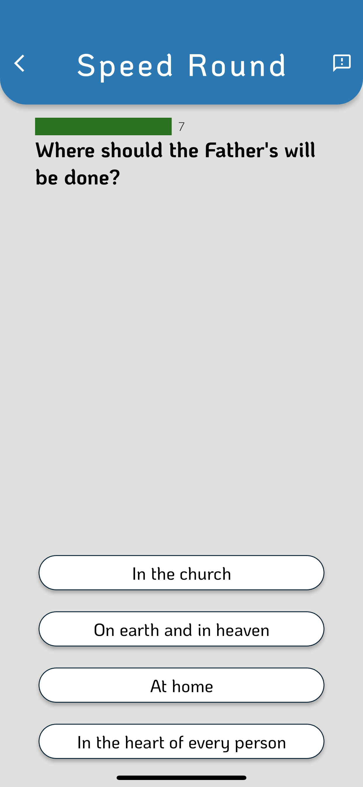

## Hi there 👋 I'm Jake, a full-time software developer by day and freelancer by night.

### I build intuitive user-friendly full-stack sites and apps.

Want to hire me?

<pre>
if (hiringFullTime) 
  click(<a href='https://jakehadley.dev'>jakehadley.dev</a>);

else if (hiringFreelancer) 
  click(<a href='https://exigent.dev'>exigent.dev</a>);
</pre>

### Some of my work

#### Social Media Clone
This is a fully featured social media app built specifically for your company or organization ([contact me](https://exigent.dev) for a quote). A demo is available on the Play Store and an App Store Test Flight link is available on request. Post, like, comment, like comments, view and create events, and access related resources all from within the app. Log in with your social, and opt in to the local career network to easily reach out to peers in your field.

  
  
  
  
  

  

#### Four Gospels Quiz (freelance)
This is a quiz game built in Flutter and on Firebase as the backend (with some fancy google scripts on a google sheet). The game features over 1,600 multiple-choice questions, score tracking, multiplayer support, and a user-friendly interface. It is built on a reusable quiz game engine that can support multiple formats and topics. It is also localized for Spanish and Portuguese.

  
  
  
  
  
  

  

  

